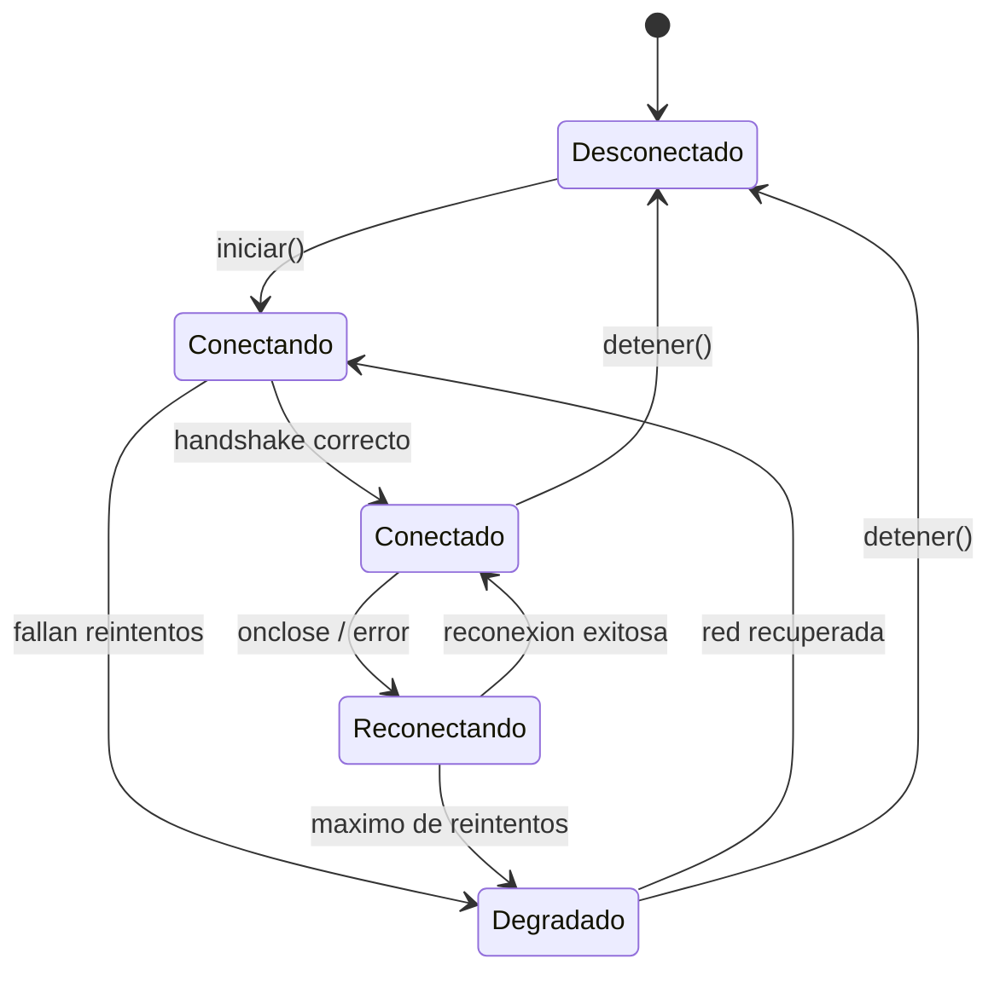

# Programacion\_distribuida\_del\_lado\_del\_cliente

En este repositorio se encuentran las actividades dejadas en las semanas


#Semana 4 :


\# Reto IA 1 - Traza mental del ciclo de polling con ETag


\## Linea temporal de 4 consultas


| Tiempo | Consulta | Headers enviados | Respuesta | Accion del cliente | Intervalo siguiente |

| --- | --- | --- | --- | --- | --- |

| 0s | 1 | `Accept: application/json` | `200 OK`, ETag `"abc123"`, body completo | Guarda datos, notifica a los observadores y almacena `ultimo\_etag = "abc123"` | 5s |

| 5s | 2 | `Accept: application/json`, `If-None-Match: "abc123"` | `304 Not Modified`, sin body | No procesa JSON ni notifica cambios; aplica backoff porque no hubo cambios | 7.5s |

| 12.5s | 3 | `Accept: application/json`, `If-None-Match: "abc123"` | `304 Not Modified`, sin body | Mantiene los datos locales y vuelve a aumentar el intervalo | 11.25s |

| 23.75s | 4 | `Accept: application/json`, `If-None-Match: "abc123"` | `200 OK`, ETag `"def456"`, body actualizado | Reemplaza los datos locales, notifica a los observadores y actualiza el ETag | 5s |


\## Por que ETag es mas eficiente


ETag evita descargar y comparar todo el inventario cuando el servidor ya sabe que no hubo cambios. En las consultas 2 y 3 el cliente recibe solo headers con `304 Not Modified`, asi que ahorra ancho de banda, evita parsear JSON innecesario y reduce trabajo tanto en el cliente como en el servidor. Comparar datos completos funcionaria, pero obligaria a descargar el inventario completo en cada ciclo.


# Reto IA 3 - Decisiones de diseno del cliente de polling

## Resumen de trade-offs implementados

1. `INTERVALO_BASE = 5s`: permite detectar cambios con retraso aceptable para inventario sin saturar al servidor con consultas constantes.
2. `INTERVALO_MAX = 60s`: limita el backoff para que el cliente no quede demasiado lento despues de varios ciclos sin cambios o errores temporales.
3. `TIMEOUT = 10s`: protege al cliente de quedar esperando indefinidamente una respuesta lenta.
4. `FACTOR_SIN_CAMBIOS = 1.5`: aumenta el intervalo de forma gradual cuando hay `304 Not Modified`.
5. `FACTOR_ERROR = 2`: reduce presion sobre el servidor cuando hay errores `5xx` o timeouts.

## Reflexion final

El cliente prioriza estabilidad y bajo consumo de red sobre inmediatez absoluta. Para EcoMarket esto es razonable porque el inventario tolera algunos segundos de retraso. Si el caso fuera una pantalla critica en tiempo real, los observadores deberian ejecutarse de forma concurrente y el intervalo maximo tendria que ser menor.


# Reto IA 4 - Auditoria del monitor

## Escenarios validados

| Escenario | Resultado observado |
| --- | --- |
| Servidor tarda mas que el timeout | El cliente registra timeout, no se queda bloqueado y aplica backoff. |
| Servidor devuelve HTML en vez de JSON | El cliente detecta contenido invalido, registra error y conserva el control del ciclo. |
| Un observador lanza una excepcion | `ServicioPolling` captura la excepcion y continua notificando a los demas observadores. |
| El servidor devuelve `productos = null` | El error queda aislado en el observador que no puede procesar el dato inesperado. |

## Prueba de desacoplamiento

Se agrego y retiro un cuarto observador sin modificar `ServicioPolling`. La clase de polling solo conoce eventos y callbacks, por lo que no depende directamente de la UI, alertas ni bitacora.

 `../Reto IA 2/validacion.log`.

# Reto IA 5 - Diseno de migracion a WebSocket

## Interfaz comun propuesta

```python
class ServicioMonitor(Observable):
    async def iniciar(self) -> None:
        ...

    def detener(self) -> None:
        ...

    def suscribir(self, evento: str, callback) -> None:
        ...

    def desuscribir(self, evento: str, callback) -> None:
        ...
```

La UI y los observadores seguirian usando los mismos eventos: `datos_actualizados`, `error_servidor`, `timeout_polling` y `estado_conexion`. El cambio principal seria interno: `ServicioPolling` consulta cada cierto tiempo, mientras `ServicioWebSocket` escucha mensajes del servidor.

## Diagrama de estados del cliente WebSocket



## Cambios que si haria en el cliente

- Crear `ServicioWebSocket` con la misma interfaz publica que `ServicioPolling`.
- Agregar estados de conexion: `desconectado`, `conectando`, `conectado`, `reconectando` y `degradado`.
- Implementar reconexion con backoff.
- Activar polling de respaldo cuando el WebSocket falle repetidamente.
- Notificar `estado_conexion` para que la UI pueda mostrar si esta en vivo o en respaldo.

## Cambios que no haria gracias a Observer

- No cambiaria los observadores de UI, alertas o bitacora.
- No cambiaria la forma de suscribirse a eventos.
- No mezclaria la logica de transporte con la logica de negocio.
- No duplicaria la validacion de productos en cada tecnologia de conexion.

# Semana 5 :

# Diagnostico pre-examen

## Resultado

El bloque que requiere mas refuerzo es **programacion asincrona**.

La laguna principal detectada fue confundir el comportamiento de una funcion
`async` cuando se invoca sin `await`. No produce un fallo de sintaxis inmediato:
devuelve una corrutina/promesa pendiente y la operacion real no se ejecuta en
ese punto. Esto puede dejar al cliente en un estado enganoso, porque parece que
se llamo a la operacion de red, pero nunca se espero ni se proceso su resultado.

## Correccion consolidada

```python
import asyncio


async def consultar_api():
    await asyncio.sleep(1)
    return {"estado": "ok"}


async def main():
    resultado = await consultar_api()
    print(resultado)


asyncio.run(main())
```

## Cierre del repaso

- Diferencio un error de red de un error HTTP: si no hay respuesta, el cliente
  registra el fallo y conserva un estado conocido; si hay un 4xx, no reintenta
  automaticamente porque la solicitud del cliente esta mal formada.
- Despues de un `200 OK`, el cliente valida tipo de contenido, estructura del
  JSON y campos obligatorios antes de usar los datos.
- Todo acceso de red asincrono debe esperarse con `await` y protegerse con
  timeout.
- El `ETag` evita procesar y notificar datos que no cambiaron.
- El Observer mantiene desacoplada la fuente de datos de la UI y de otros
  consumidores.

## Accion tomada

Repase el ciclo `async/await`, corregi el modelo mental sobre corrutinas no
esperadas y use ese punto debil como criterio de revision para el simulacro del
Reto 2.

# Docstring de decisiones del Hito 1

## Resumen validado

1. `TIMEOUT_HTTP = 10s` -> equilibra tolerancia a respuestas lentas con deteccion
   rapida de un servidor que no responde.
2. `INTERVALO_BASE = 5s` -> permite datos suficientemente frescos sin consultar
   la API de forma agresiva.
3. `REINTENTOS_MAX = 3` -> absorbe fallos temporales sin ocultar por demasiado
   tiempo una indisponibilidad real.
4. `short polling con ETag` -> evita trabajo innecesario cuando los datos no
   cambiaron y mantiene el cliente simple.
5. `Observer` -> desacopla el monitor de la UI y permite agregar consumidores
   nuevos sin modificar la logica de polling.

## Correccion critica al resumen

La decision de backoff no debe justificarse desde la comodidad del servidor
solamente. En el cliente tambien protege bateria, conexiones, tiempo de espera
del usuario y estabilidad del ciclo asincrono. Esa precision se reflejo en el
docstring del archivo de codigo.

# Diagnostico de escenarios criticos

## A. Timeout

- **Entrada:** el servidor tarda 45s y el cliente tiene `TIMEOUT_HTTP = 10`.
- **Resultado esperado:** se captura `asyncio.TimeoutError`.
- **Comportamiento del cliente:** registra el timeout, retorna `None`, conserva
  vivo el ciclo de polling y aplica backoff.
- **Estado:** manejado en `monitor_pedidos.py`.

## B. HTTP 422

- **Entrada:** el servidor responde `422` con un error de validacion.
- **Resultado esperado:** no se reintenta automaticamente.
- **Comportamiento del cliente:** registra error 4xx y retorna `None`, porque
  repetir la misma solicitud no corregira un dato mal enviado por el cliente.
- **Estado:** manejado en `monitor_pedidos.py`.

## C. `{"pedidos": null}`

- **Entrada:** el servidor responde `200 OK`, pero la lista de pedidos viene
  como `null`.
- **Riesgo:** iterar sobre `None` produciria un `TypeError`.
- **Comportamiento del cliente:** valida la estructura antes de notificar; si
  `pedidos` no es lista, registra respuesta invalida y retorna `None`.
- **Estado:** corregido en `_respuesta_valida()`.

## D. HTTP 503

- **Entrada:** el servidor responde `503 Service Unavailable`.
- **Resultado esperado:** se considera fallo temporal del servidor.
- **Comportamiento del cliente:** aumenta `fallos_consecutivos`, retorna `None`
  y deja que el ciclo aplique backoff con jitter hasta el limite configurado.
- **Estado:** manejado en `monitor_pedidos.py`.

## E. HTTP 304 con ETag

- **Entrada:** el servidor responde `304 Not Modified`.
- **Resultado esperado:** no se notifica a observadores porque no hay datos
  nuevos.
- **Comportamiento del cliente:** retorna `None`, conserva el ultimo estado y
  aumenta gradualmente el intervalo de polling.
- **Estado:** manejado en `monitor_pedidos.py`.

## Resultado general

El cliente sobrevive a los cinco escenarios sin detener silenciosamente el ciclo
asincrono. Los fallos quedan visibles en consola y el estado anterior se conserva
cuando no hay datos nuevos validos.

# Extension avanzada: jitter en backoff

## Problema observado

Con backoff puro, muchas instancias del cliente pueden quedar sincronizadas tras
una caida compartida del servidor. Desde la perspectiva de mi cliente, eso se
traduce en mas timeouts, conexiones rechazadas y recuperacion lenta, porque
compite al mismo tiempo que otros clientes por el mismo servicio.

## Linea aplicada

```python
self.intervalo_actual = min(
    self.intervalo_actual * FACTOR_BACKOFF
    + random.uniform(0, self.intervalo_actual * FACTOR_BACKOFF * 0.2),
    INTERVALO_MAX,
)
```

## Comentario para el docstring

El jitter beneficia a mi cliente porque reduce la probabilidad de reconectar al
mismo instante que otras instancias, aumentando sus oportunidades de obtener una
respuesta exitosa durante una recuperacion parcial del servicio.

## Preview de circuit breaker

Si el servidor sigue caido durante varios minutos, el jitter solo distribuye los
reintentos, pero el cliente aun gasta bateria, conexiones y tiempo. Un circuit
breaker del lado cliente detiene temporalmente los intentos despues de varios
fallos consecutivos y solo vuelve a probar despues de una ventana de espera.


#Semana 6 :

# Reto IA 1 - Traza mental del flujo SSE

La traza completa esta en el encabezado de `receptor_alertas.py`. Muestra la conexion inicial, los tres eventos, el keep-alive, la interrupcion y la reconexion con `Last-Event-ID: 3`.

En mi implementacion elegi la Ruta A con Python porque permite ver lo que EventSource normalmente oculta: lectura linea por linea, acumulacion de `data:`, deteccion de la linea en blanco y reconexion manual.

Para ejecutar una demostracion local sin depender de internet:

```powershell
python .\receptor_alertas.py
```

El resultado esperado incluye eventos de precio, stock y pedido, un comentario keep-alive, actualizacion de `retry` y el ultimo ID listo para reconectar.

# Reto IA 2 - Receptor de Alertas EcoMarket

Entrega Ruta A completada con Python:

- `receptor_alertas.py` esta en `Reto IA 1` porque tambien contiene la traza del Reto 1 y el docstring de trade-off del Reto 3.
- `validacion.log` documenta conexion inicial, tres tipos de evento, reconexion con `Last-Event-ID` y los 7 puntos del checklist.
- La implementacion usa timeout de 30 segundos, respeta `retry:`, limita la reconexion a 5 intentos, reinicia el buffer al terminar cada mensaje y permite parada limpia con bandera.

Eventos cubiertos por la prueba:

| Tipo | Resultado |
| --- | --- |
| `precio-actualizado` | Actualiza la tabla simulada de precios |
| `stock-critico` | Imprime alerta de inventario |
| `pedido-nuevo` | Registra un pedido recibido |

# Reto IA 3 - Docstring de trade-off

El docstring de trade-off esta integrado al encabezado de `Reto IA 1/receptor_alertas.py`, como pide la entrega.

Resumen de decisiones:

| Escenario | Eleccion | Justificacion tecnica |
| --- | --- | --- |
| A: 10,000 usuarios y precios que cambian 2-3 veces por hora | SSE | Reduce peticiones vacias; cada cliente mantiene una conexion y solo recibe datos cuando hay cambios |
| B: servidor legacy solo REST | Polling | Es la unica opcion si el servidor no puede emitir `text/event-stream` |
| C: cliente movil con red inestable | Polling o SSE con recuperacion fuerte | Las conexiones largas se caen seguido; si se usa SSE necesita `Last-Event-ID`, backoff y buen control de reconexion |
| D: panel recibe alertas y envia filtros dinamicos | WebSocket | Se requiere comunicacion bidireccional persistente; SSE solo empuja servidor -> cliente |

# Semana 7 - EcoMarket

Entrega final de ClienteSSEMultiplex. La carpeta contiene el cliente ejecutable,
la validacion con 10 eventos mixtos y la auditoria de los 4 escenarios de fallo.

## Decisiones de diseno entendidas antes de codificar

### 1. Tres EventSource contra el mismo origen

Si abro 3 objetos EventSource en un navegador con limite tipico de 6 conexiones
HTTP/1.1 por origen, quedan 3 conexiones libres para otras peticiones como
`fetch()`. Si ademas necesito autenticacion periodica, esas 3 ranuras libres se
vuelven valiosas: una conexion lenta o colgada podria dejar al panel sin espacio
para operaciones normales. Por eso una sola conexion multiplexada es mejor para
el cliente cuando los modulos pueden viajar en el mismo stream.

### 2. Python con requests o urllib

Python no hereda exactamente el limite del navegador de 6 conexiones por origen.
Lo limitan el sistema operativo, el pool de conexiones de la libreria HTTP, los
timeouts, los descriptores de archivo disponibles y la propia arquitectura del
programa. Aun asi, abrir muchas conexiones persistentes sigue siendo mas dificil
de monitorear y cerrar que mantener un unico stream con routing por tipo.

### 3. Evento sin handler registrado

Si llega `event: precio-actualizado` y el cliente no tiene handler para ese tipo,
el comportamiento correcto es ignorarlo silenciosamente. No es error de conexion:
el stream sigue siendo valido. Esta decision permite que el servidor agregue
tipos nuevos sin romper clientes antiguos.

### 4. Agregar devoluciones sin reconectar

No puedo agregar el modulo `devoluciones` a una suscripcion activa si los modulos
van en parametros de URL. La URL se envio al abrir la conexion. Para cambiarla,
el cliente debe cerrar la conexion actual, construir una nueva URL con
`devoluciones` incluido y reconectar. Durante esa reconexion puede haber una
pausa temporal en la recepcion de eventos.

### Sintesis correctiva

Entendi que la multiplexacion no elimina el trabajo del cliente: lo mueve a un
EventRouter que decide que handler recibe cada evento. Tambien confirme que
Last-Event-ID es memoria de progreso del cliente durante reconexiones, no un
mecanismo para cambiar modulos activos. La parte que corregi fue no pensar en
"mejorar el servidor" como objetivo principal; aqui la decision se evalua por
conexiones abiertas, estado del cliente, handlers y tolerancia a fallos.

## Evidencia de implementacion

- `cliente_sse_multiplex.py`: implementa `EventRouter`, `ClienteSSEMultiplex`,
  construccion de URL, parseo SSE, despacho de eventos, maquina de estados,
  backoff, Last-Event-ID, parada limpia y 4 handlers de EcoMarket.
- `validacion.log`: contiene una demo con 10 eventos mixtos. El evento 5 fuerza
  una excepcion en `handler_precio_actualizado`; el evento 6 llega a
  `handler_stock_critico`, demostrando que un handler fallido no corta el flujo.
- `event_router_prioritizado.py`: entrega opcional del Reto 5.

## Por que elegi decorador para EventRouterPrioritizado

Elegir decorador conceptual mantiene aislado a `ClienteSSEMultiplex`. El cliente
no necesita saber si el router tiene prioridades; solo llama
`router.despachar(tipo, datos)`. Tambien conserva compatibilidad con
`registrar(tipo, fn)` porque la prioridad tiene valor por defecto. Heredar podria
funcionar, pero acoplaria la extension a detalles internos del router original.
Para esta entrega, envolver el comportamiento es mas claro y protege la interfaz.

## Resultado de validacion

Los 4 escenarios de auditoria pasaron:

- Datos no JSON: se registra el error y el siguiente evento se procesa.
- Reconexion: `Last-Event-ID` se conserva y se envia en headers simulados.
- Tipo desconocido: se ignora sin lanzar excepcion.
- `iniciar()` con conexion activa: se rechaza sin abrir una segunda conexion.

# Semana 9 :

# Reto IA 1 - Diagrama de estados validado

## Dialogo con IA, version final

Mi descripcion inicial fue: el Circuit Breaker inicia cerrado, cuenta fallos
consecutivos del servidor y se abre al llegar al umbral. Mientras esta abierto,
rechaza peticiones sin contactar al servidor. Cuando vence el timeout pasa a
semiabierto y permite una sola peticion de prueba. Si esa peticion funciona,
vuelve a cerrado; si falla, vuelve a abierto con un timeout completo nuevo.

La revision de IA marco correcto el flujo general y senalo un caso borde: en
semiabierto no basta con "permitir pruebas", debe permitirse exactamente una
prueba activa para evitar que varias llamadas simultaneas golpeen al servidor.

Correccion aplicada: el estado `SEMIABIERTO` usa `asyncio.Lock` y
`_probe_en_curso`, de modo que solo una llamada remota pasa y las demas reciben
`CircuitOpenError`.

## Diagrama final

```text
CERRADO --N fallos 5xx/red/timeout--> ABIERTO
ABIERTO --timeout_apertura cumplido--> SEMIABIERTO
SEMIABIERTO --1 exito de prueba------> CERRADO
SEMIABIERTO --fallo de prueba--------> ABIERTO
ABIERTO --peticion antes del timeout-> CircuitOpenError sin tocar servidor
```

# Reto IA 2 - Clasificacion de errores

| Caso | Decision | Motivo |
| --- | --- | --- |
| 500 Internal Server Error | Cuenta como fallo | El servidor fallo al procesar una peticion valida. |
| 502 Bad Gateway | Cuenta como fallo | Problema aguas arriba o gateway invalido. |
| 503 Service Unavailable | Cuenta como fallo | El servicio no puede responder y debe reducirse presion. |
| 504 Gateway Timeout | Cuenta como fallo | El backend no respondio a tiempo. |
| Timeout local | Cuenta como fallo | Para el cliente equivale a no tener respuesta util. |
| ConnectionError/OSError | Cuenta como fallo | Indica problema de red o servicio no alcanzable. |
| 401 Unauthorized | No cuenta | Debe llegar al TokenManager para renovar sesion. |
| 404 Not Found | No cuenta | No prueba caida del servidor; es URL/recurso del cliente. |
| 422 Validation Error | No cuenta | Error de datos enviados por el cliente. |
| 429 Too Many Requests | No cuenta en este breaker | Se atiende con backoff/rate-limit especifico. |

# Reto IA 6 - Separacion de responsabilidades

| Componente | Lo que sabe | Lo que no sabe |
| --- | --- | --- |
| CircuitBreaker | Estado del circuito, contador de fallos, timeout y clasificacion general de errores. | JWT, URLs concretas, JSON de negocio, productos o precios. |
| TokenManager | Token actual y renovacion de credenciales. | Estado del breaker, retries de negocio o disponibilidad del servidor de inventario. |
| ClienteRobusto | Ordena la obtencion de token, llamada protegida y notificacion a UI. | No implementa reglas internas del breaker ni del ciclo de vida del token. |

La arquitectura evita dependencia circular: `ClienteRobusto` conoce a
`TokenManager` y `CircuitBreaker`; esos componentes no conocen al cliente. La UI
recibe cambios de estado mediante observadores registrados con
`al_cambiar_estado`.
